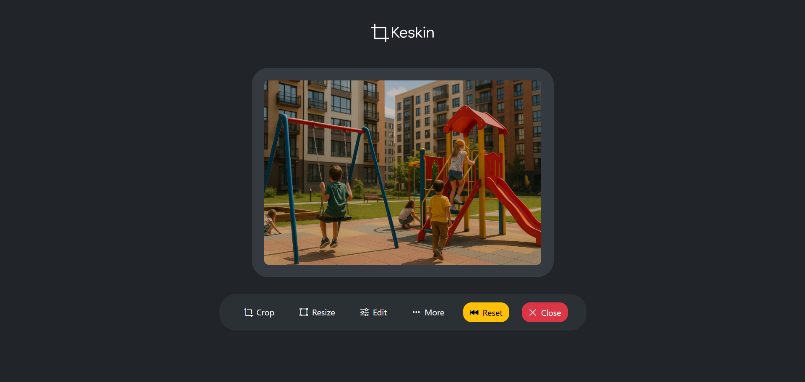

# Keskin — Smart Image Editor for Web

**Keskin** is a minimal, fast, and offline-ready browser-based image editor. No installation, no sign-up — just open and edit. Built for developers, designers, and creators who need quick image editing tools right in the browser.

---

## ✨ Features

* 🖼 Upload images via drag & drop or file picker
* ✂️ Crop tool with presets: Square, Portrait, Landscape, and Custom
* 📀 Resize images to specific dimensions
* 🎨 Apply filters (brightness, contrast, blur, etc.)
* 📅 Export as original or convert to **PNG**, **JPEG**, **WebP**
* ⚙️ Adjust quality level during export
* 🔄 Reset to original image at any time
* 🧠 Image info panel (dimensions, type, size)
* 💡 Works entirely offline (no server, no tracking)

---

## 🧹 Tech Stack

* React + Next.js (App Router)
* Bootstrap 5.3 (for UI)
* `react-easy-crop` (crop tool)
* AOS (for animations)
* No database, no backend – 100% in-browser

## 🛠 Use Cases

* Quick image resizing for social media
* Exporting images for PWA (Progressive Web App) icons
* Generating images for favicons or Open Graph
* Prototyping graphics on the fly

---

## 📦 Upcoming

* [ ] Batch editing
* [ ] Presets for export (favicon, PWA, Instagram)
* [ ] Compress-only mode
* [ ] Offline-first PWA mode with manifest generator

---

## 📄 License

MIT License © 2025 [Temirkhan Rustemov](https://github.com/DreamerView)

---

## ❤️ Acknowledgements

Built with love for creators who value **speed**, **privacy**, and **precision**. Inspired by tools like [Photopea](https://www.photopea.com/) and [Squoosh](https://squoosh.app/).
